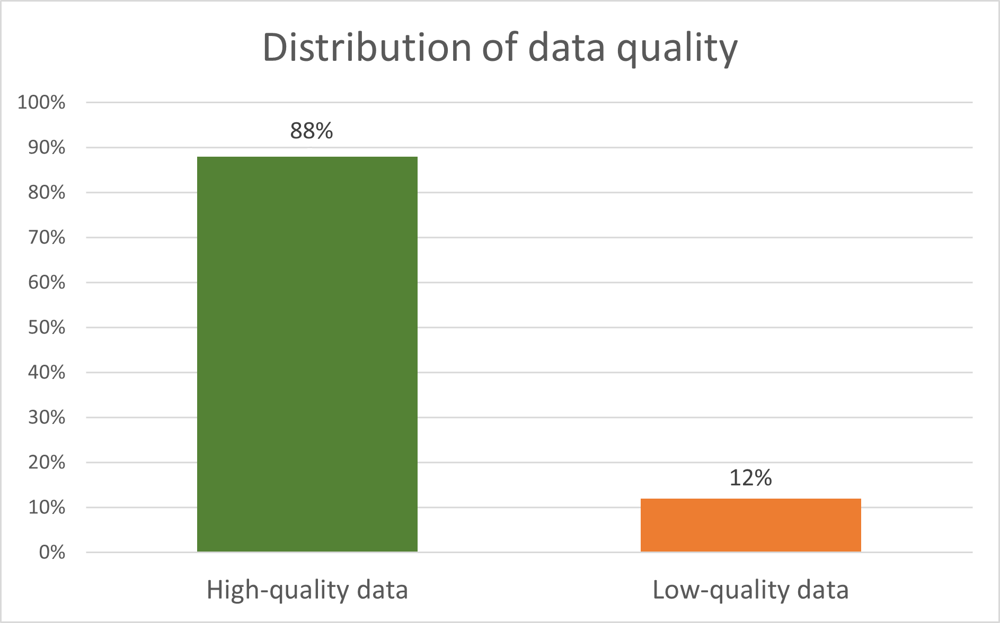

# **About**
This analysis was conducted with the goal of developing an algorithm that would allow to get high-quality data from the whole dataset of businesses in Chicago. The dataset was downloaded from [this website](https://data.cityofchicago.org/Community-Economic-Development/Business-Licenses-Current-Active/uupf-x98q).

# **Analysis**
Looking at the dataset, it was noticed that there are certain records that have the same attributes, with the exception of ID, business activities, and business activitiy IDs.

| ID      | DBA | Business activity|
| ----------- | ----------- |-----------|
| 1821587-20220916 | MUNCHIES | Retail Sale of Tobacco |
| 1821586-20220916 | MUNCHIES | Retail Sales of Perishable Foods |

Such activities were merged into one record with a new attributes business activities and business activities IDs. They contained a list of all business activities and their IDs. Regarding IDs, only the first one was taken. 

| ID      | DBA | Business activities|
| ----------- | ----------- |-----------|
| 1821587-20220916 | MUNCHIES | Retail Sale of Tobacco, Retail Sales of Perishable Foods |

That resulted in the reduction of the dataset site by 20% (from 51,505 to 41,399 records). The remaining of the analysis was conducted on this merged dataset.

The following table shows the missing values in the merged dataset:

| Attribute | Missing values (%) |
| --------- | ------------------ |
| Legal name | 0 |
| Doing business as (DBA) | 0.1 |
| State | 0 |
| City | 0 |
| ZIP code | < 0.1 |
| Address | 0 |
| Ward | 0.1 |
| Precint | 27 |
| Ward-precint | 0.1 |
| Police district | 28 |
| Latitude | 1 |
| Longitude | 1 |
| Location | 1 |
| Business activities | 10 |
| Business activities ID | 10 |

The next thing that was noticed is that some addresses have [REDACTED FOR PRIVACY] instead of a real value. In that case, latitude, longitude, and location are also missing. There are 246 such records.

It was also checked whether all IDs are unique. There are no duplicate IDs.

Regarding the state attribute, there are two records which have Chicago as the city, but their states are not Illinois.

| ID      | City | State|
| ----------- | ----------- |-----------|
| 2652776-20210316 | Chicago | ID |
| 2627344-20211016 | Chicago | IN |

Since many businesses activities are from the same industry, but different branch, they are standardized so only the industry remain, e.g. Hair, Nail, and Skin Care Services and Body Piercing are standardized as beauty salon. This was done to allow easier search for desired business.

| ID      | DBA | Business activities | Standardized activities |
| ----------- | ----------- |-----------| ---------- |
| 2744389-20220916	 | Boar's Head Cafe | Preparation and Sale of Coffee and/or Drinks, Sale of Food Prepared Onsite With Dining Area | restaurant
 | 2642142-20220616 | The Original Pancake House | Preparation of Food and Dining on Premise With Seating | restaurant

Finally, an algorithm was developed that takes a subset of the dataset that meets the following criteria:

- name: it must have both legal name and DBA. 
- address: it must have address and location. [REDACTED FOR PRIVACY] not allowed
- state: it must be in Illinois
- ZIP Code starts with 606, 607, or 608
- business activities: it has to contain the list of business activities

The criteria was set based on the attributes that are most important for identifying a buisness. The result of this algorithm shows that 88% records in the dataset are high-quality data.

# **License** 
All files in this project are licensed under the [GNU General Public License v3.0](./LICENSE).